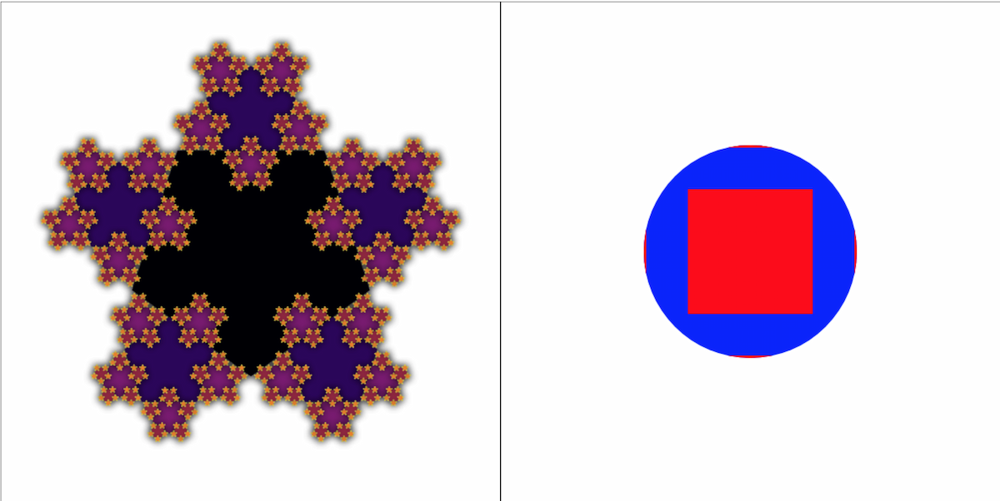

## Functional bindings for the HTML Canvas API

**Inspired by**

- [purescript-canvas](https://github.com/purescript-contrib/purescript-canvas)
- [purescript-free-canvas](https://github.com/paf31/purescript-free-canvas)
- [purescript-drawing](https://github.com/purescript-contrib/purescript-drawing)

# Installation

To install the stable version:

```
npm install graphics-ts @fp-ts/core @effect/core @effect/data
```

Note: `fp-ts` and `fp-ts-contrib` are peer dependencies for `graphics-ts`

# Documentation

- [API Reference](https://gcanti.github.io/graphics-ts/docs/modules)

## Getting started
Typically each program will
  1. Use the `C.*` methods to create an Effect for a canvas.
  2. Provide the effect a canvas via `C.renderTo(someCanvasContextElOrId)`
  3. Call `IO.run*` on the effect.

The simplest way to get started is with `Canvas.use` which runs a function inside an `Effect`.
Later, we can use `C.renderTo` to provide the real canvas. 

```ts
import * as C from 'graphics-ts/Canvas'
import * as IO from '@effect/io/Effect'
const rectangle = C.use((canvas) => {
  canvas.moveTo(50, 50)
  canvas.setFillStyle = 'magenta'
  canvas.fillRect(10, 10, 100, 100)
})
void IO.runPromise(C.renderTo('canvasId')(rectangle))
```

## Using
There are a few ways you can use this library, each building on top of the previous.
  1. Thread a canvas rendering context to your existing functions.
  2. Use ithe `Canvas` module methods directly.
  3. Use the `Drawing` and `Shape` modules.
  4. Create custom or enhance existing `Drawable` instances.

### Level 1: `Canvas.useContext`
This library (more specifically dependeny injection features of the `Effect` library)
can simplify providing a canvas to your existing code.  For example, you might have
functions such as
```ts
import * as C from 'graphics-ts/Canvas'
import * as IO from '@effect/io/Effect'
import { pipe } from '@fp-ts/core/Function'
function drawRect(canvas: CanvasRenderingContext2D) {
  canvas.fillStyle = 'magenta'
  canvas.fillRect(40, 40, 20, 20)
}
function drawCircle(canvas: CanvasRenderingContext2D) {
  canvas.fillStyle= 'purple'
  canvas.arc(50, 50, 5, 0, Math.PI * 2)
  canvas.fill()
}
```

You can pass these to `C.use`
```ts
void IO.runPromise(pipe(
  C.use(drawRect),
  C.renderTo('canvas')
))
```
or you can use `Effect` functions to combine them

```ts
void IO.runPromise(
  C.renderTo('canvas3')(
    IO.collectAllDiscard([C.use(drawCircle), C.use(drawRect)])
  )
)
```

### Level 2: `Canvas` methods
Instead of operating directly on a canvas with `C.use()`, you can
use the methods from the `Canvas` to compose these operations.

```ts
const drawNestedRect = IO.collectAll([
  C.setFillStyle('magenta'),
  C.fillRect(-20, -20, 40, 40),
  C.setFillStyle(Color.toCss(Color.hsla(180, 0.5, 0.5, 0.5))),
  C.fillPath(C.rect(-5, -5, 10, 10)),
])
```

With this drawing function, we can use `IO.loopDiscard` to rotate the canvas
and, with a small delay between each, animate it.

```ts
void pipe(
  C.translate(50, 50),
  IO.zipRight(
    IO.loopDiscard(
      0,
      _ => _ <= 360,
      z => z + 1,
      z => IO.delay(rotateRect(z), Duration.millis(16))
    )
  ),
  C.renderTo('canvas3'),
  IO.runPromise
)
```


### Level 3: `Drawing` and `Shape`
The above code works, but it's difficult to reason about a bunch of strokes on a canvas.  Instead, the high-level API provided by the `Drawing` and `Shape` modules make it easy to construct pure data structures which can later be rendered to the canvas.

These pure structures are easier to reason about, test, duplicate and transform than chicken scratch on a canvas.

Here we use a static `nestedRectangleDrawing` and `rotateRectDrawing(angle)`  to create the `Drawing`.  Calling `D.render` will actually render the drawing to the canvas.

```ts
const nestedRectDrawing = D.combineAll([
  D.fill(
    S.rect(-50, -50, 100, 100),
    D.fillStyle(Color.white),
  ),
  D.fill(
    S.rect(-20, -20, 40, 40),
    D.fillStyle(Color.hsla(-180, 0.5, 0.5, 1))
  ),
  D.outline(
    S.rect(-5, -5, 10, 10),
    D.outlineColor(Color.hsla(-180, 0.5, 0.25, 1))
  ),
])

const rotateRectDrawing = (z: number) => pipe(
  nestedRectDrawing,
  D.rotate(z),
  D.translate(50, 50)
)
const withDrawing = C.withContext(
  loopCircle(z => IO.delay(
    D.render(rotateRectDrawing(z)),
    Duration.millis(16)
  ))
)
void IO.runPromise(C.renderTo('canvas3')(withDrawing))
```

## Example

To run the example, clone the repository and run the following:

```
pnpm install
pnpm start
open http://localhost:5173/
```



Adapted from https://github.com/purescript-contrib/purescript-drawing/blob/master/test/Main.purs
